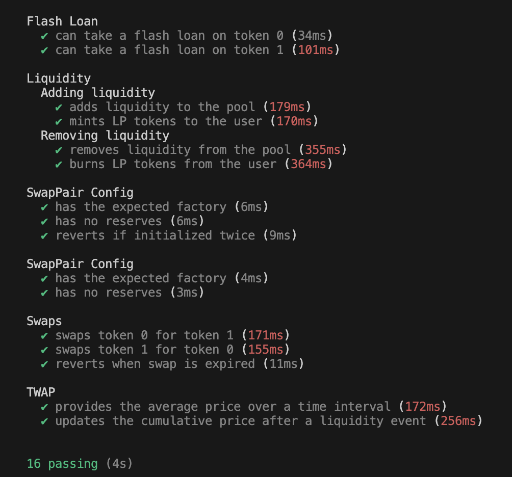

# RareSkills Advanced Solidity Bootcamp - Uniswap

A remake of [Uniswap V2 core](https://github.com/Uniswap/v2-core/tree/master/contracts) with the following changes:

- Use solidity > 0.8.0

- Use [PRBMath](https://github.com/PaulRBerg/prb-math) fixed point library.
- Use Openzeppelin’s SafeTransfer
- Use EIP3156 instead of implementing a flash swap the way Uniswap does.
- Don't use SafeMath


### Main Contracts
- [Swap Pool](contracts/SwapPool.sol) - Pool contract that allows to swap a pair of ERC tokens + EIP3156 Flash loans.
- [Swap Pool Factory](contracts/SwapPoolFactory.sol) - Factory contract to deploy swap pool for a pair of ERC20 tokens.

### Tests

```
$ npx hardhat test
```

